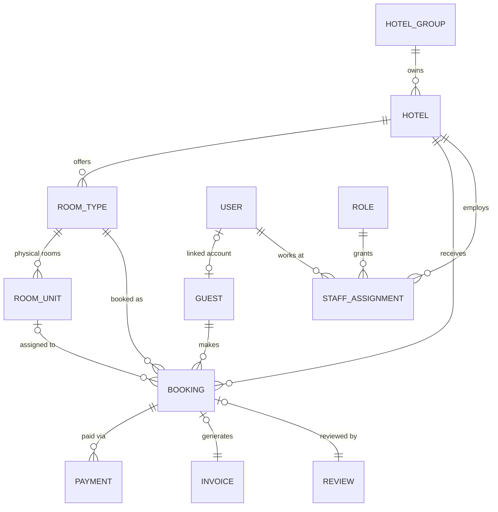
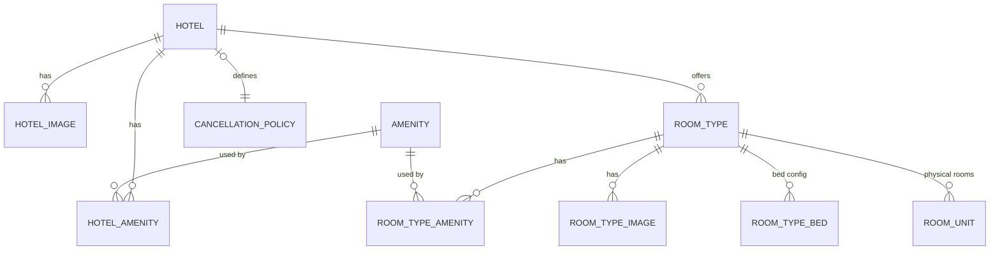
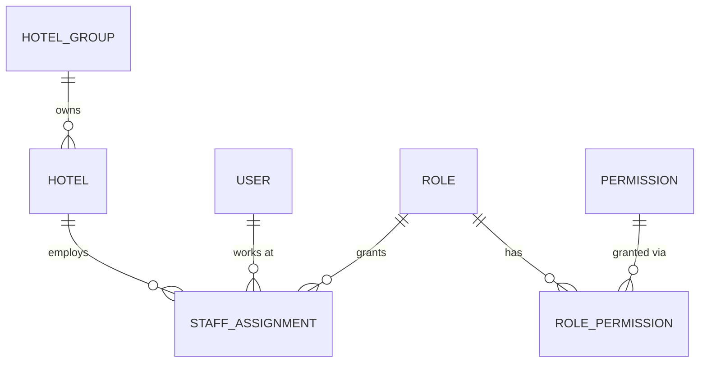
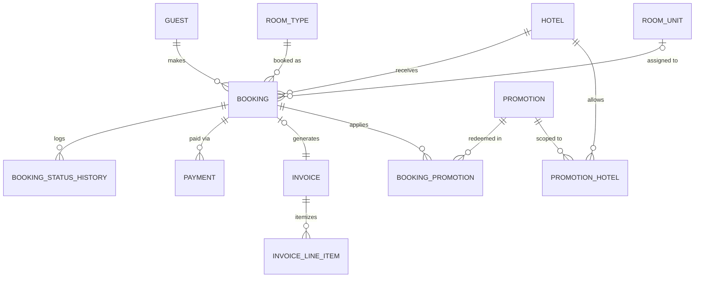
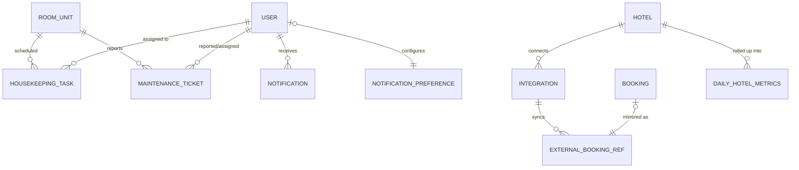

# Database Architecture

This document explains the schema in [`prisma/schema.prisma`](../prisma/schema.prisma), designed by auditing every screen currently implemented in the app and projecting the data model forward to the features described in the brief (multi-hotel management, roles/permissions, payments, invoices, housekeeping, maintenance, promotions, analytics, notifications, third-party integrations).

**Status:** schema-only. No local Postgres instance is reachable in this environment (`DATABASE_URL=localhost:5432`, connection refused), so nothing has been migrated or seeded — `prisma format` / `prisma validate` / `prisma generate` all pass, confirming the schema itself is syntactically and referentially correct. Run `prisma migrate dev` once a real database is available.

---

## 1. UI audit → data requirements

Every screen was read before designing a single table. Here's what each one requires:

| Screen | Data it needs |
|---|---|
| `/` , `/rooms`, `/rooms/[id]` | Hotels, room types, images, amenities, bed config, price, capacity, rating |
| `/gallery`, `/hotels/[id]` | Hotel list with search, per-hotel room types |
| `/booking/[id]` | Guest contact form (no login required), payment method choice (Card / Pay at hotel), price breakdown (base, service fee, tax, total) |
| `/booking/confirm` | Confirmation code, hotel, dates+times, total — currently hardcoded, needs real Booking + Hotel data |
| `/about`, `/contact` | Static content today; contact form has no backend (**gap**, see §5) |
| `/login` | Credentials auth (already backed by `User`/`Account`/`Session` via Auth.js) |
| `/admin` (dashboard) | Stat counts (available/occupied rooms, check-ins/outs, revenue), recent bookings, occupancy calendar |
| `/admin/rooms`, `/admin/rooms/new`, `/admin/rooms/[number]/edit` | Room type CRUD, per-room status (Available/Occupied/Maintenance/Hidden), amenities, photos with a "Cover" flag |
| `/admin/bookings`, `/admin/bookings/[id]` | Booking list/detail, status transitions (Cancel/Check-in/Check-out), payment status, guest info |
| `/admin/calendar` | Per-day check-in/check-out events, "+N view more" |
| `/admin/guests` | Guests aggregated across bookings, independent of login |
| `/admin/settings` | Profile fields + notification toggles (New bookings / Cancellations / Guest messages) |
| Admin topbar | Notification bell (mock list today) |

Exact status vocabularies pulled directly from the UI (`meridian-data.ts`) and mapped into enums:

- Booking: `Confirmed`, `Pending`, `Checked in`, `Checked out`, `Cancelled` → `BookingStatus`
- Payment: `Paid`, `Pending`, `Refunded` → `PaymentStatus` (+`Failed` added for the payments feature)
- Room: `Available`, `Occupied`, `Maintenance`, `Hidden` → `RoomUnitStatus`

---

## 2. Key architectural decisions

**RoomType vs. RoomUnit.** The current mock data conflates "Tide Suite" (a listing with a price, photos, description) with "room #204" (a physical, numbered room housekeeping cleans and maintenance repairs). The schema splits these: `RoomType` is what guests browse and book; `RoomUnit` is the physical inventory a booking is ultimately assigned to and what `HousekeepingTask`/`MaintenanceTicket` track. This is the single most important change for "scale to thousands of hotels" — without it, adding real inventory tracking later would mean restructuring the whole booking table.

**Guest vs. User.** The booking form on `/booking/[id]` never requires login. So `Booking` doesn't point at `User` — it points at `Guest`, a CRM-style record keyed by email. `Guest.userId` is a nullable 1:1 back to `User`, set only if that person later creates an account. This matches `/admin/guests`, which already aggregates by guest identity with no login involved.

**Deliberate denormalization.** `Booking.hotelId`, `RoomUnit.hotelId`, and `Review.hotelId` are technically derivable through joins (`Booking → RoomUnit → RoomType → Hotel`), but are stored directly. At "millions of bookings" scale, that join tax on every dashboard/list query is worse than the small redundancy — this is a standard hotel-PMS tradeoff, not an oversight. Booking pricing (`baseAmount`, `taxAmount`, etc.) is likewise **snapshotted** on the booking row rather than recomputed from current room prices, so historical receipts stay correct after a price change.

**Roles are two-layered.** `User.systemRole` (GUEST/STAFF/ADMIN/SUPER_ADMIN) is a coarse enum for cheap, joinless auth-guard checks (e.g. middleware gating `/admin`). `Role` + `Permission` + `RolePermission` + `StaffAssignment` layer fine-grained, **per-hotel** permissions on top — the same person can be Manager at one property and Front Desk at another, and new permission keys can be added without a migration.

**Testimonials are just featured reviews.** The homepage testimonials and the review system aren't separate concepts — `Review.isFeatured` is what the public site queries. `Review.bookingId` is unique and required, so every review is guaranteed to come from a real, completed stay (no drive-by reviews).

**Amenities and bed types are normalized.** The room detail page's amenity checklist and the rooms-browser bed-type filter currently work against free-text strings (`beds: "1 King bed"`, substring-matched). `Amenity` is a shared catalog joined to both `Hotel` and `RoomType`; `RoomTypeBed` stores structured `(bedType, quantity)` rows so filtering is an indexed equality check instead of a string match.

---

## 3. Entity Relationship Diagram

Grouped by domain for readability (paste into [mermaid.live](https://mermaid.live) or a Markdown preview with Mermaid support to render).

### 3.1 Overview — core relationships

### 3.2 Property structure & catalog

### 3.3 Roles & permissions

### 3.4 Bookings, payments & promotions

### 3.5 Operations, notifications & integrations

---

## 4. Table-by-table reference

### Identity & access
| Table | Purpose |
|---|---|
| `users`, `accounts`, `sessions`, `verification_tokens` | Auth.js-compatible identity tables (unchanged shape, kept adapter-compatible). `User.systemRole` gives cheap coarse-grained auth checks. |
| `roles` | Named permission bundles ("Manager", "Front Desk"), creatable without a migration. |
| `permissions` | Individual grantable capabilities (e.g. `bookings.manage`). New features register a key here, not a new column. |
| `role_permissions` | N:N join between roles and permissions. |
| `staff_assignments` | N:N-with-payload join: which `User` holds which `Role` at which `Hotel`. Enables one person managing several properties. |

### Guest CRM
| Table | Purpose |
|---|---|
| `guests` | Anyone who has ever booked, whether or not they have a login. `userId` is optional, set only when linked to an account. |

### Property structure
| Table | Purpose |
|---|---|
| `hotel_groups` | Optional parent brand/chain owning many hotels — enables multi-property portfolios without touching `Hotel`. |
| `hotels` | One physical property. Denormalized `code` (booking-reference prefix), `currency`, `checkInTime`/`checkOutTime`, `serviceFeeCents`, `taxRatePercent` so pricing rules aren't hardcoded per-hotel in application code. |
| `hotel_images` | Ordered gallery with an `isCover` flag, replacing the current `String[]` on Hotel. |
| `amenities` | Shared catalog (icon + label), reused by both hotels and room types. |
| `hotel_amenities` | N:N join, hotel ↔ amenity. |
| `cancellation_policies` | 1:1 with `Hotel`; structured free-cancellation window instead of hardcoded copy. |

### Room inventory
| Table | Purpose |
|---|---|
| `room_types` | The sellable listing (what guests browse: "Tide Suite", price, description, capacity). |
| `room_type_images`, `room_type_amenities` | Same pattern as the hotel-level tables, scoped to a room type. |
| `room_type_beds` | Structured `(bedType, quantity)` rows powering the bed-type filter. |
| `room_units` | The physical, numbered room. Denormalizes `hotelId` for a `(hotelId, unitNumber)` uniqueness constraint and joinless operational queries. Carries `RoomUnitStatus`. |

### Bookings & payments
| Table | Purpose |
|---|---|
| `bookings` | Core reservation. Snapshots guest contact info and full price breakdown at time of booking; denormalizes `hotelId`. `roomUnitId` is nullable until a specific physical room is assigned. |
| `booking_status_history` | Audit trail of every status transition (mirrors the Cancel/Check-in/Check-out buttons in the admin UI), including who made the change. |
| `payments` | 1:N — a booking can have several payments (deposit + balance, or a refund). Carries method/status/provider reference. |
| `invoices`, `invoice_line_items` | 1:1 invoice per booking, itemized to mirror the "Room × nights / Service fee / Taxes / Total" breakdown already shown in the UI. |

### Promotions
| Table | Purpose |
|---|---|
| `promotions` | Coupon/discount definitions (percentage or fixed amount), with redemption limits and a validity window. |
| `promotion_hotels` | N:N — restricts a promotion to specific hotels (empty = valid everywhere). |
| `booking_promotions` | N:N-with-payload — which promotions were applied to a booking and for how much. |

### Reviews
| Table | Purpose |
|---|---|
| `reviews` | 1:1 with `Booking` (one review per completed stay, guaranteeing it's verified). `isFeatured` reviews are what the homepage renders as testimonials — no separate table needed. |

### Operations
| Table | Purpose |
|---|---|
| `housekeeping_tasks` | Cleaning/inspection/turndown tasks against a `RoomUnit`, assignable to staff. |
| `maintenance_tickets` | Repair/issue tracking against a `RoomUnit`, with reporter, assignee, and priority. |

### Notifications
| Table | Purpose |
|---|---|
| `notifications` | Backs the admin topbar bell dropdown (currently a hardcoded mock list). |
| `notification_preferences` | 1:1 with `User`, backing the three toggles on `/admin/settings` exactly as labeled today. |

### Content & CRM
| Table | Purpose |
|---|---|
| `faqs` | `hotelId` nullable — null rows are the platform-wide defaults shown today; a hotel can override with its own. |
| `contact_messages` | Persists the `/contact` form, which currently has **no backend at all** (see §5). |

### Integrations & analytics
| Table | Purpose |
|---|---|
| `integrations` | One row per connected channel (Booking.com, Expedia, a payment processor), with a JSON `config` blob so new providers don't need schema changes. |
| `external_booking_refs` | Maps a local `Booking` to an external reservation ID for OTA sync, isolated from the booking core. |
| `daily_hotel_metrics` | Pre-aggregated daily rollup (occupancy, revenue, ADR, RevPAR) per hotel, populated by a scheduled job. Exists so the admin dashboard doesn't aggregate raw booking rows on every page load once there are millions of them. |

---

## 5. UI elements with no backing table yet (gaps found during the audit)

These exist visually today but aren't wired to any data — flagging them explicitly since the schema now supports all of them:

1. **Contact form (`/contact`)** — no `action`, no server function, inputs aren't even wired to state. → `ContactMessage`.
2. **"My bookings" / guest account area** — there is no post-login page for a guest to see their own bookings; `/login` only leads to `/admin`. → would query `Booking` by `Guest.userId` once built.
3. **Review submission** — testimonials are static; there's no UI for a guest to leave a review after a stay. → `Review`, gated on `booking.status = CHECKED_OUT`.
4. **Admin notification bell** — mock array in `topbar.tsx`. → `Notification`.
5. **Admin settings toggles** — local `useState`, resets on reload. → `NotificationPreference`.
6. **Promotions/coupons** — no UI anywhere (booking form has no promo code field). → `Promotion` + `BookingPromotion` are ready whenever that field is added.
7. **Housekeeping/maintenance boards** — room status shows Maintenance today but there's no task list. → `HousekeepingTask` / `MaintenanceTicket`.
8. **Booking confirmation page (`/booking/confirm`)** — entirely hardcoded (guest name "Amara", ref "MRD-4821"). → should read a real `Booking` by `confirmationCode`.

---

## 6. Indexing strategy

- **Foreign keys** are indexed everywhere they're queried directly (`hotelId`, `roomTypeId`, `guestId`, etc.) rather than relying on implicit index-free FK scans.
- `bookings(roomUnitId, checkIn, checkOut)` — the availability-check query (avoid double-booking a unit for overlapping dates) needs this compound index. Prisma can't express a true `EXCLUDE` constraint; once on real Postgres, add a `btree_gist` exclusion constraint via a raw SQL migration for hard double-booking prevention at the database level, not just application logic.
- `bookings(status)`, `room_units(status)` — both directly power admin list filters (status chips in `/admin/bookings`, `/admin/rooms`).
- `notifications(userId, isRead)` — composite, matches "unread notifications for this user" which is the only real query pattern for the bell dropdown.
- `daily_hotel_metrics(hotelId, date)` unique — one rollup row per hotel per day, and the natural lookup key for a date-range dashboard chart.
- `reviews(hotelId)`, `reviews(isFeatured)` — separately indexed since "all reviews for hotel X" and "featured reviews site-wide" are both real, independent query patterns.

## 7. Deliberately out of scope for now

- **Multi-room "cart" reservations.** The current UI books exactly one room per checkout. `Booking` stays one-room-per-row; a future `BookingGroup` wrapper table could tie several bookings together for a single checkout without restructuring anything here.
- **Multi-currency conversion / FX.** `Hotel.currency` and `Booking.currency` exist as fields, but no conversion table — fine while every hotel in the mock data prices in USD.
- **A generic tax-rule engine.** `Hotel.taxRatePercent` / `serviceFeeCents` are flat per-hotel values, not a rules engine (e.g. per-room-type tax bands). Add a `PricingRule` table if that's ever needed; nothing here blocks it.
